## Pojęcia
SOHO -  odnosi się do urządzeń przeznaczonych głównie dla małych biur i domowych biur (ang. Small Office/Home Office), stąd skrót SOHO. Są to zazwyczaj produkty typu IoT, takie jak routery, kamery monitoringu, inteligentne urządzenia domowe (np. termostaty, żarówki, gniazdka), drukarki, czy też urządzenia do przechowywania danych (np. NAS - Network Attached Storage).

## Protokoły 

#### MQTT (Message Queuing Telemetry Transport)
MQTT - to lekki protokół komunikacyjny, który został opracowany z myślą o urządzeniach z ograniczonymi zasobami, takich jak czujniki i urządzenia IoT.
Jest protokołem opartym na modelu klient-serwer, w którym klienci komunikują się z brokerem (serwerem MQTT) za pomocą publikowania (publish) i subskrybowania (subscribe) wiadomości.
Wiadomości w protokole MQTT są zorganizowane w tematy (topics), które umożliwiają klientom subskrybowanie określonych tematów lub publikowanie wiadomości do określonych tematów.
MQTT jest charakteryzowany przez swoją prostotę, niskie zużycie energii oraz zdolność do obsługi komunikacji w warunkach o ograniczonych zasobach.
Jest szeroko stosowany w aplikacjach IoT, gdzie istnieje potrzeba przesyłania danych telemetrycznych, takich jak dane z czujników, do serwerów lub innych urządzeń.

#### CoAP (Constrained Application Protocol):

CoAP to protokół zaprojektowany specjalnie dla urządzeń IoT o ograniczonych zasobach, takich jak mikrokontrolery, czujniki i urządzenia wbudowane.
Jest protokołem opartym na architekturze RESTful, co oznacza, że korzysta z podobnych metod komunikacji jak HTTP, takich jak GET, POST, PUT i DELETE.
CoAP umożliwia przesyłanie danych między urządzeniami w sieciach IoT z minimalnym zużyciem zasobów, co obejmuje zarówno przepustowość, jak i zużycie energii.
W przeciwieństwie do protokołu HTTP, CoAP jest bardziej zoptymalizowany pod kątem działania w warunkach sieciowych z dużymi opóźnieniami, o niskiej przepustowości i dużym pakietowym błędzie.
Jest często wykorzystywany w aplikacjach IoT, gdzie konieczne jest niskie zużycie energii i komunikacja w sieciach z ograniczonym zasięgiem, takich jak sieci sensorów w środowisku miejskim czy przemysłowym.

#### ZigBee
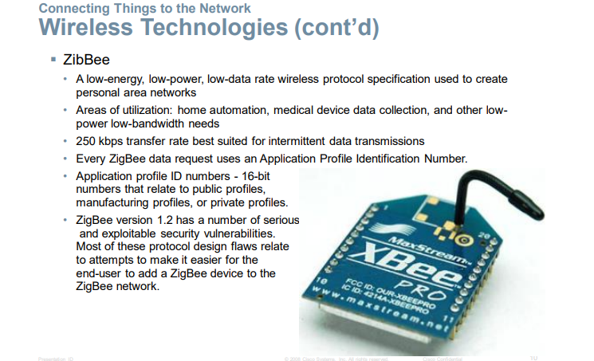
ZigBee to bezprzewodowy protokół komunikacyjny, który został opracowany specjalnie dla sieci o niskim zużyciu energii (ang. Low-Power, Low-Duty Cycle).
Jest on często wykorzystywany w sieciach opancerzonych, takich jak inteligentne domy, systemy automatyki przemysłowej i zarządzania budynkami oraz w aplikacjach IoT.
Charakteryzuje się niskim zużyciem energii, niskim kosztem implementacji i możliwością obsługi wielu węzłów w sieci.
ZigBee działa na niskim zakresie częstotliwości, co może zapewniać większy zasięg w porównaniu do niektórych innych protokołów, jednak ogranicza to przepustowość danych.

#### Bluetooth
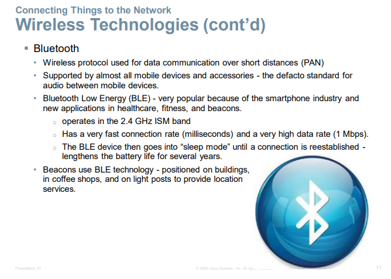

Bluetooth to technologia bezprzewodowa stosowana przede wszystkim w urządzeniach mobilnych, takich jak smartfony, tablety, słuchawki, itp.
Protokół Bluetooth umożliwia komunikację krótkiego zasięgu między urządzeniami, zazwyczaj w promieniu do kilku metrów.
Jest szeroko stosowany w zastosowaniach IoT, takich jak smartfony łączące się z urządzeniami domowymi, monitorowanie zdrowia, lokalizacja przedmiotów itp.
Bluetooth Low Energy (BLE) to wersja protokołu Bluetooth zaprojektowana specjalnie dla aplikacji o niskim zużyciu energii, co sprawia, że jest coraz bardziej popularna w IoT.

#### 4G/5G
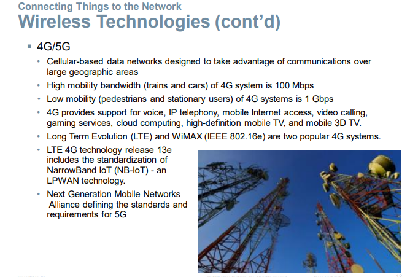
4G i 5G to standardy komunikacji bezprzewodowej stosowane w sieciach szerokopasmowych komórkowych.
Zapewniają one wysoką przepustowość danych i niskie opóźnienia, co czyni je odpowiednimi do aplikacji wymagających dużej przepustowości, takich jak transmisja strumieniowa wideo czy chmura obliczeniowa.
Chociaż są one mniej popularne w zastosowaniach IoT niż w przypadku transmisji danych mobilnych, mogą być wykorzystywane w niektórych zastosowaniach IoT o wysokich wymaganiach dotyczących przepustowości.

#### LoRaWAN
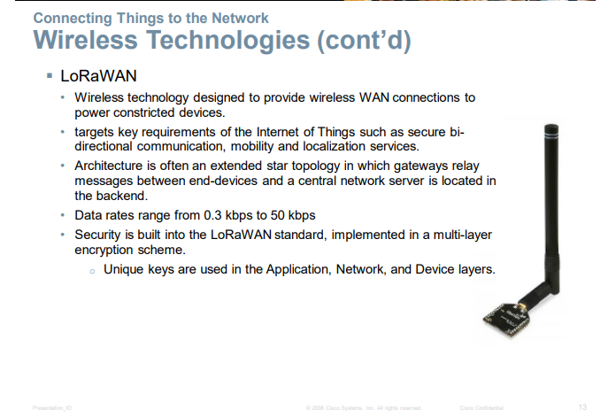
LoRaWAN (Long Range Wide Area Network) to protokół komunikacyjny zaprojektowany specjalnie dla długich zasięgów i niskiego zużycia energii w sieciach IoT.
Wykorzystuje on modulację LoRa (Long Range), która umożliwia komunikację na dużych odległościach, nawet do kilku kilometrów w warunkach miejskich.
LoRaWAN jest idealny dla aplikacji IoT, gdzie urządzenia są rozmieszczone na dużym obszarze lub w trudno dostępnych miejscach, takich jak monitoring środowiska, zarządzanie parkingiem, czy monitorowanie infrastruktury.

#### LPWAN
LPWAN, czyli Low Power Wide Area Network

#### Fog Computing Model: (przeciwieństwo Cloud Computing Model)
Fog computing to model architektury informatycznej, w którym przetwarzanie danych odbywa się bliżej źródła danych, czyli tam, gdzie dane są generowane lub używane.
W przeciwieństwie do tradycyjnego modelu chmury obliczeniowej, gdzie przetwarzanie odbywa się w odległych centrach danych, w modelu fog computing przetwarzanie może być realizowane na urządzeniach znajdujących się w pobliżu użytkowników, np. na brzegu sieci.
Główne zalety fog computing to szybsza reakcja na dane w czasie rzeczywistym, zmniejszenie opóźnień w transmisji danych, ograniczenie obciążenia sieci oraz zwiększenie prywatności i bezpieczeństwa danych poprzez przetwarzanie ich bliżej ich źródła.
Model fog computing może być szczególnie korzystny w przypadku aplikacji IoT, gdzie duże ilości danych są generowane przez urządzenia sensoryczne, a szybka reakcja na te dane jest kluczowa.

### Dane

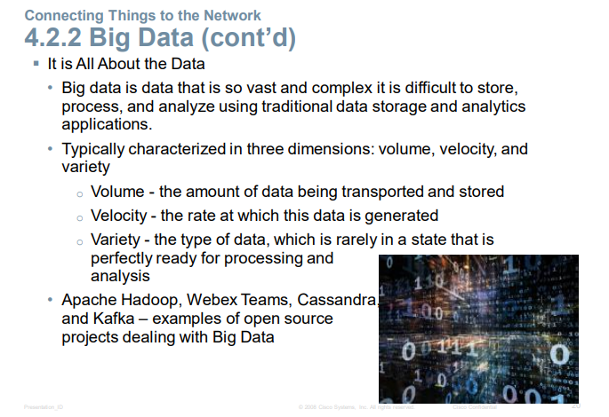

Objętość - ilość danych transportowanych i przechowywanych 

Prędkość - szybkość, z jaką te dane są generowane

Różnorodność - rodzaj danych, które rzadko są w stanie doskonale gotowym do przetwarzania i analizy

### Modele

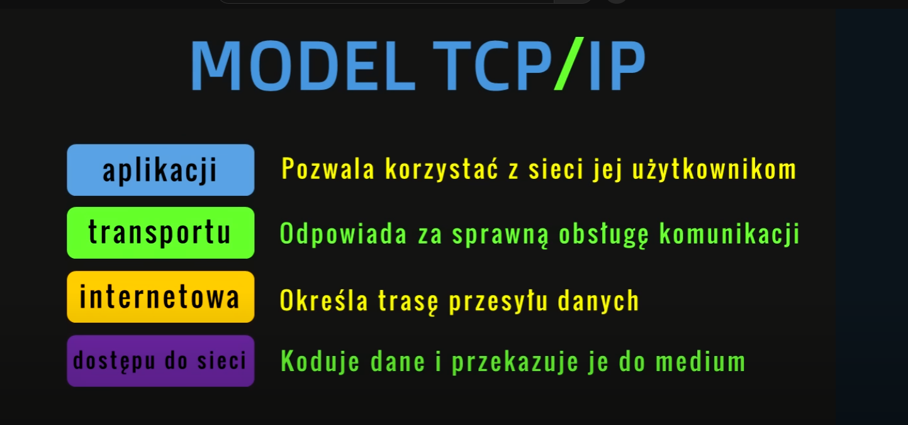
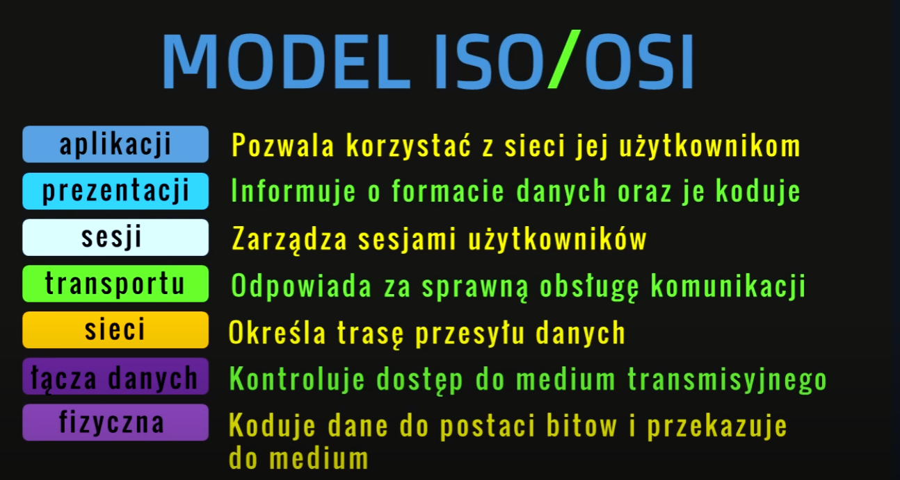
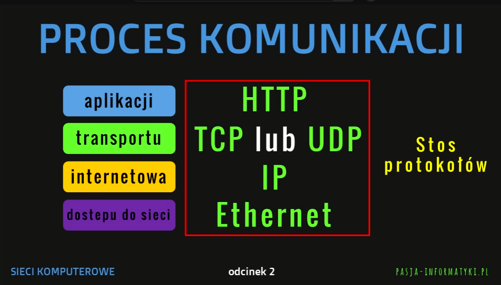
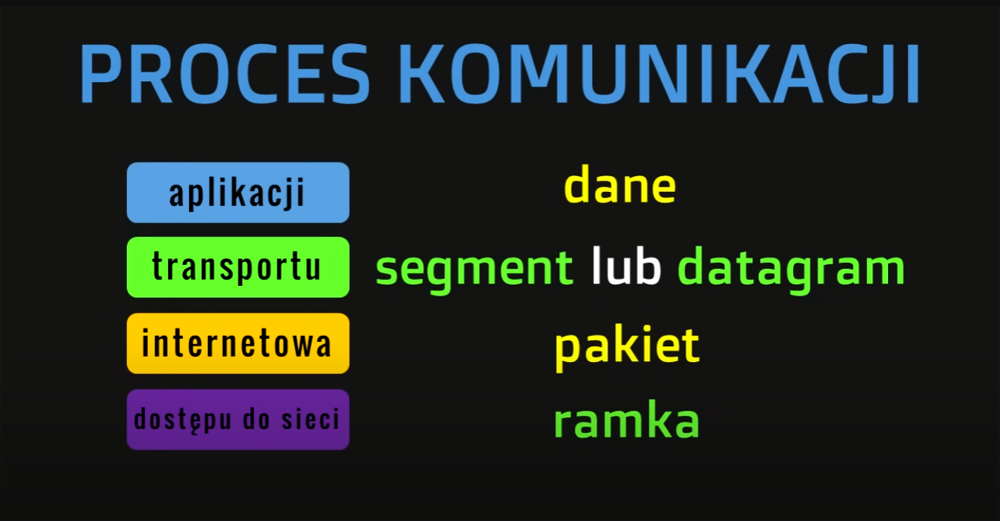
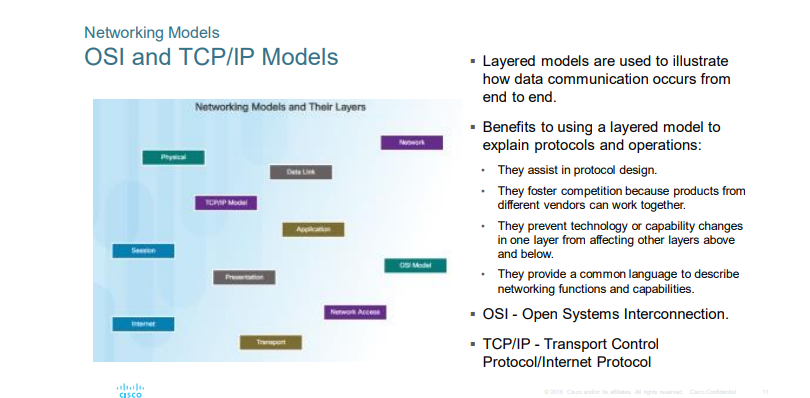

#### ARM

Podsumowując, Architectural Reference Model (ARM) jest narzędziem, które pomaga w projektowaniu, analizie i ocenie architektury systemów informatycznych poprzez zapewnienie abstrakcyjnego i standaryzowanego sposobu opisu złożonych struktur systemowych. Jest to ważne narzędzie dla architektów systemów, inżynierów oprogramowania oraz decydentów odpowiedzialnych za rozwój i utrzymanie systemów informatycznych.

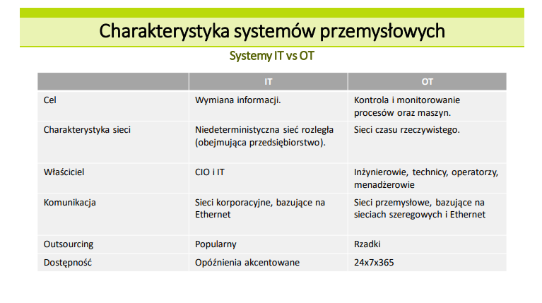
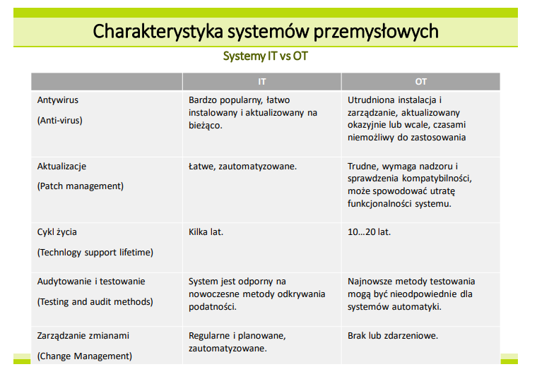
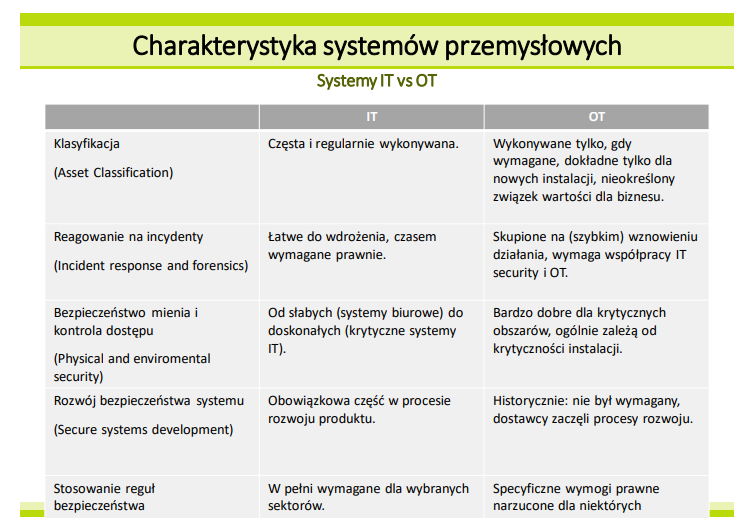
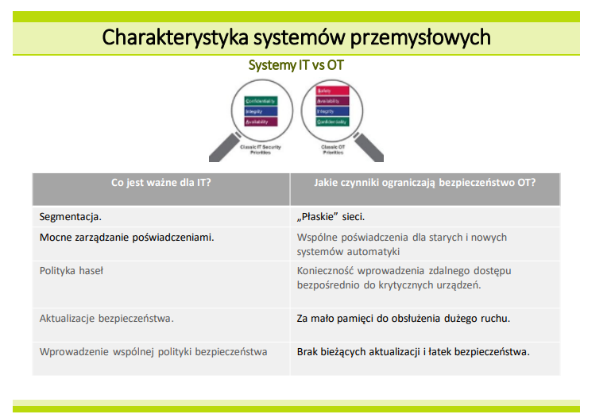

#### DMZ

DMZ (Demilitarized Zone) to pojęcie stosowane głównie w kontekście sieci komputerowych, zwłaszcza w zakresie bezpieczeństwa sieciowego. DMZ jest obszarem sieci znajdującym się pomiędzy zewnętrzną (publiczną) siecią a wewnętrzną (prywatną) siecią organizacji lub przedsiębiorstwa.

Główne cechy DMZ to:

Izolacja: DMZ zapewnia pewien stopień izolacji między zewnętrzną siecią (np. Internetem) a wewnętrzną siecią organizacji. Jest to miejsce, w którym umieszczane są zasoby, do których muszą mieć dostęp zarówno użytkownicy spoza sieci organizacji, jak i wewnętrzni użytkownicy.

Ochrona: DMZ jest zazwyczaj wykorzystywane do umieszczenia zasobów publicznie dostępnych, takich jak serwery internetowe, serwery poczty elektronicznej, serwery VPN (Virtual Private Network) czy też serwery proxy. Jest to także miejsce, w którym mogą być umieszczone urządzenia przeznaczone do monitorowania i filtrowania ruchu sieciowego, takie jak firewalle.

Bezpieczeństwo: Ustawienie DMZ pomaga w zwiększeniu bezpieczeństwa sieci poprzez ograniczenie dostępu zewnętrznych użytkowników do wrażliwych zasobów i danych znajdujących się wewnętrznie w sieci organizacji.

DMZ jest ważnym elementem architektury sieciowej, szczególnie w organizacjach, które hostują zasoby i usługi publicznie dostępne przez Internet. Poprawne skonfigurowanie i zarządzanie DMZ jest kluczowe dla zapewnienia odpowiedniego poziomu bezpieczeństwa sieciowego.

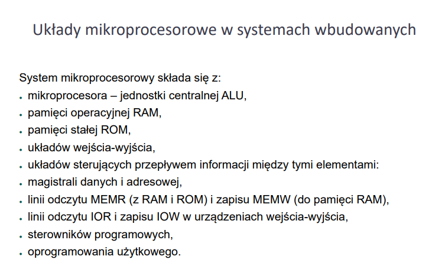

### Purdue
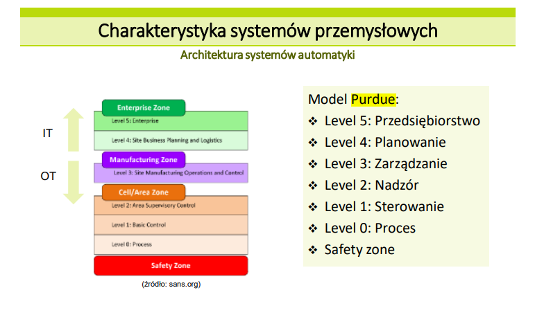
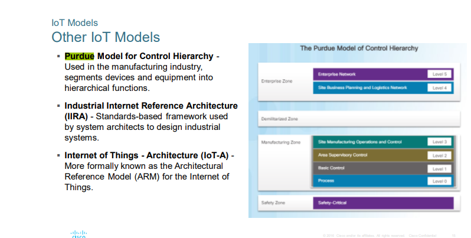
Model Purdue, znany również jako Purdue Enterprise Reference Architecture, to architektura referencyjna stosowana w przemyśle do zaprojektowania i zarządzania systemami sterowania przemysłowego. Nazwa "Purdue" pochodzi od Uniwersytetu Purdue, gdzie została opracowana w latach 90.

Model Purdue został stworzony w celu zapewnienia struktury organizacyjnej i technicznej dla systemów sterowania przemysłowego oraz pomocy w zrozumieniu relacji między różnymi elementami systemu. Model ten opiera się na koncepcji warstwowej architektury, dzięki czemu system jest podzielony na różne poziomy, a każdy poziom ma określone funkcje i role.

Główne założenia Modelu Purdue to:

Izolacja poziomów: Model ten definiuje kilka poziomów, które są izolowane od siebie w celu zapewnienia bezpieczeństwa, niezawodności i optymalnej wydajności systemu. Izolacja ta pomaga również w zarządzaniu i utrzymaniu systemu.

Rozdzielenie produkcji od administracji: Model Purdue oddziela warstwy produkcyjne, odpowiedzialne za kontrolę i monitorowanie procesów przemysłowych, od warstw administracyjnych, które zajmują się zarządzaniem i planowaniem produkcji.

Model Purdue składa się z następujących warstw (od najniższej do najwyższej):

Warstwa Pola (Field Level): Na tym poziomie znajdują się urządzenia terenowe, takie jak sensory, aktywatory, przetworniki analogowo-cyfrowe, które zbierają dane z procesu i kontrolują urządzenia przemysłowe.

Warstwa Sterowania (Control Level): Odpowiada za kontrolę i monitorowanie procesów produkcyjnych na poziomie lokalnym. W tej warstwie znajdują się kontrolery programowalne (PLC), sterowniki przemysłowe, panele operatorskie itp.

Warstwa Przemysłowa (Industrial Level): Zajmuje się zbieraniem, przetwarzaniem i przechowywaniem danych z poziomu pola oraz zapewnia komunikację między różnymi urządzeniami na poziomie sterowania.

Warstwa Zarządzania Produkcją (Enterprise Level): Odpowiada za zarządzanie procesami produkcyjnymi, planowanie produkcji, zarządzanie zasobami, raportowanie itp.